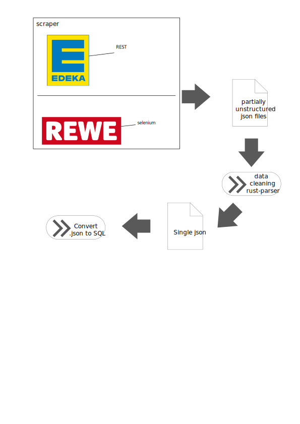

[](https://actions-badge.atrox.dev/kuehlfrank/database/goto?ref=main)
# Database
Custom postgres databse


## Data pipeline

### Scrape data
We provide data scrapers for [EDEKA Rezepte](https://www.edeka.de/rezepte/suche.jsp) and [REWE Rezepte](https://www.rewe.de/rezepte/). Both of these will output data in the same format.
```sh
cd ./apicrawler
rm -r {quantities,ingredients,recipes} # (optinally) reset scraped data
python3 recipeAPIcrawler_edeka.py
python3 recipeAPIcrawler_rewe.py # you may terminate after some minutes
```
This will create 3 directories with a lot of data

### Data cleaning
The scraped data is very unhandy right now. This is were our `rust-parser` comes to help.
```sh
cd ./apicrawler/rust-parser
cargo run
```
This will produce `./apicrawler/recipes/recipes.json.new`

### Generate SQL INSERT Statements from data
#### Generate optimized SQL Statements from data (recommended)
Run this to generate SQL Insert Statements from `./apicrawler/recipes/recipes.json.new`.
```sh
python3 testdata_sql_generator.py
```

### Package everything into Docker
```
docker build --tag ghcr.io/kuehlfrank/database:latest .
```


## Misc
#### Insert the new data into a Database
```sh
cd ./apicrawler
python3 insertRecipesIntoDb.py
```

#### Convert to optimized SQL
This will convert the single SQL Statements from `original-testdata.sql` to optimized SQL INSERTS and save them to `2-testdata.sql`.
```sh
python3 testdata_converter.py
```
